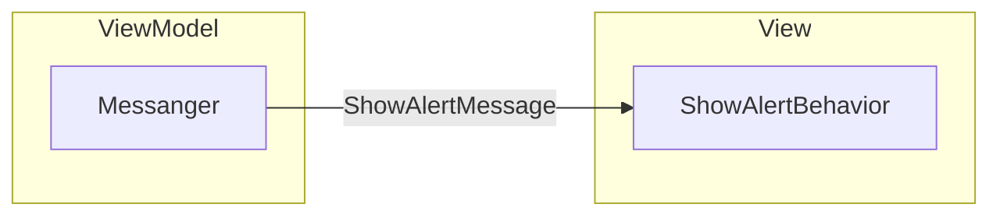

# wpf_net48_behavior_example1

## 概要
以下の実現方法を模索する。

1. ViewModel と View を Messenger でつなぐ
1. ViewModel から View への依頼(MessageBoxの表示とか)は Messenger 経由で行う
1. View は Messenger で受信した依頼を処理するが、処理は View に直接記述するのではなく Behavior として実装する(再利用のためとか諸々)
1. 全ての View に共通で持たせたい処理は App から Style で適用する( Behavior を使用するのも Style で適用するのも、個々の View にゴリゴリ書きたくないから)



## メモ

1. Behavior はアタッチする対象のインスタンス毎に、Behavior クラスのインスタンスも必要になる

1. Style は適用される対象ごとに新しいインスタンスは作成されず、同じインスタンスが適用される

1. Behavior を Style で適用しようとすると、上記2.のとおり Style は同じインスタンスを適用するが Behavior は個別にインスタンスを作成しないと正しく動作しないため、個別のインスタンスが作成されるように対処する必要がある(下記サイトを参照)  
  WPFのBehaviorをStyleで使う方法  
  https://blog.okazuki.jp/entry/2016/07/19/192918

1. Style は TargetType で指定したタイプの派生クラスには適用されない

1. Style を全ての Window に適用したい場合は、App の StartUp などで以下を記述する  
    App.xaml.cs
    ```cs
    FrameworkElement.StyleProperty.OverrideMetadata(
        typeof(Window),
        new FrameworkPropertyMetadata(Application.Current.FindResource(typeof(Window)))
    );
    ```
    App.xaml
    ```xml
    <Application.Resources>
        <Style TargetType="Window" BasedOn="{StaticResource {x:Type Window}}">
            <Setter Property="Background" Value="Blue"/>
            <Setter Property="local:StyleBehaviorCollection.StyleBehaviors">
                <Setter.Value>
                    <local:StyleBehaviorCollection>
                        <local:ShowMessageBoxBehavior />
                    </local:StyleBehaviorCollection>
                </Setter.Value>
            </Setter>
        </Style>
    </Application.Resources>
    ```

## TODO

- Behavior を使って 他の View を表示する
- View に設定する ViewModel は DIContainer から取得するが、Behavior から DIContainer にどうやってアクセスさせるか…  
( Behavior は XAML 側でインスタンス化するので注入するタイミングがない。できれば static は使いたくない... Messenger 経由で渡すか？... 要検討)

## Nuget

- CommunityToolkit.Mvvm  
  https://www.nuget.org/packages/CommunityToolkit.Mvvm

- Microsoft.Xaml.Behaviors.Wpf  
  https://www.nuget.org/packages/Microsoft.Xaml.Behaviors.Wpf

## 参考

- WPFのBehaviorをStyleで使う方法  
  https://blog.okazuki.jp/entry/2016/07/19/192918